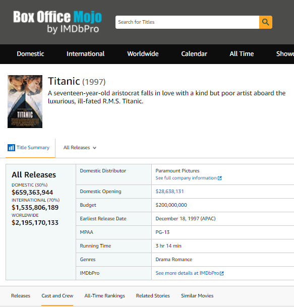
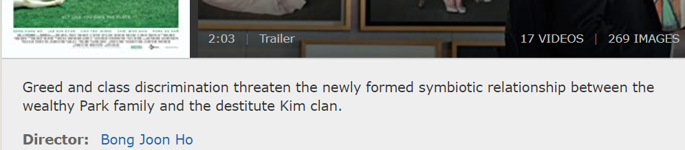
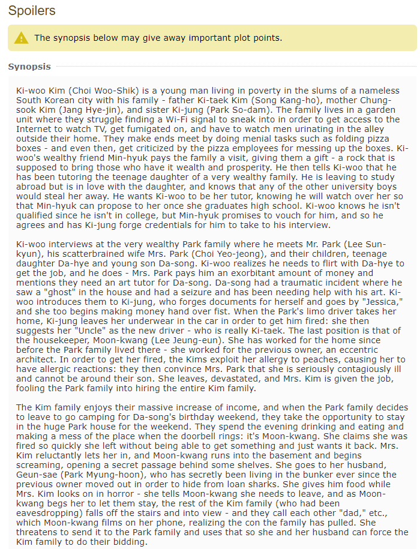

# BoxOfficeMojo web [scraper](/Scrape_BOM.ipynb)

I went over 250000 pages on boxofficemojo website and scraped only US movies with a listed budget. When I say US movies I mean that they are available in English and have USA MPAA rating. That means they had US release but not necessarily the US made. These are movies released from 1990 to April 2020.
List of movie codes to scrape I took from [IMDB datasets](https://datasets.imdbws.com/)
In July 2008, the boxofficemojo was purchased by Amazon.com through its subsidiary, IMDb. So now IMDB and Mojo share the same movie codes.

**List of scraped items: 'movie_id', 'title', 'year', 'trivia', 'mpaa', 'release_date', 'run_time', 'distributor', 'director', 
                       'writer', 'producer', 'composer', 'cinematographer', 'main_actor_1', 'main_actor_2', 'main_actor_3', 
                       'main_actor_4', 'budget', 'domestic', 'international', 'worldwide', 'genre_1', 
                       'genre_2', 'genre_3', 'genre_4'**

Here is scraped [Dataset](https://www.kaggle.com/igorkirko/imdb-summary-trivia) on Kaggle

# Imdb web [scraper](/Scraper_imdb.ipynb)

Another scraper I made for my [project](https://github.com/Maja-Thurup/Classify-movie-genres-from-text-data-using-neural-networks)
This dataset contains:
**Short summary** 
- Length       50-200 symbols
- Quantity     90k items

**Synopsis** 
- Length        500-10 000 symbols
- Quantity      11k items

**List of all scraped items: 'title', 'year', 'mpaa', 'run_time', 'rating', 'ratings_count', 'budget', 'world_gross', 'genre', 'director', 
                       'writer', 'actor', 'keywords', 'summary', 'synopsis'**
                       
                       
        
